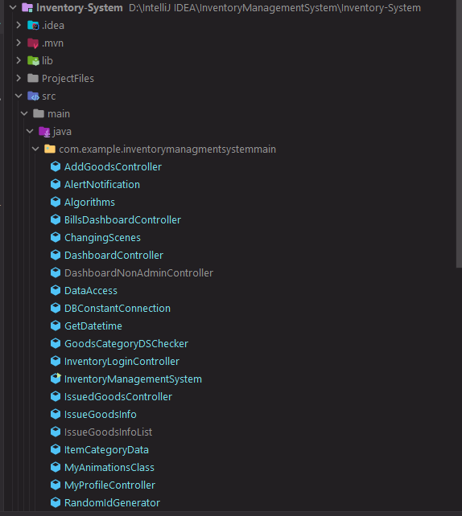
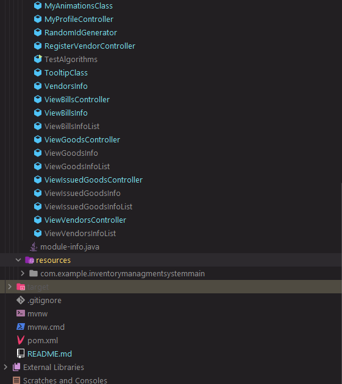

# Inventory management system

# Project Structure

# The lib folder contains all the library dependency you can import in to the project

> The main java class is the *InventoryManagementSystem.java*

> Logins for the app auths
The login for the frontend logins
- Admin Id: 2468
- Password: structures
> Non admin logins
- user Id: 8642
- password: vendor

## Some Java files and their functions
- The DBConstantConnection.java establishes connection with the MySQLWorkbench server
  - It contains the MySQL server *password*, *root* and *url* for making connection to the server.
- Algorithms.java contains some algorithms.
- DataAccess.java contains sql queries for retrieving and storing goods and information about vendors into database. It also contains code for keeping balance between high and low price.

## Implementation of data Structures
- AddGoodsController.java and DataAccess.java contain codes for adding and removing of goods in their various structures
    - stacks 
    - queue
    - list
- ViewVendorsController.java uses HashMap to display information about vendors
- RegisterVendorController.java also uses HashMap to store information about vendor and store them into the database.
- IssuedGoodsController.java uses queue for the adding of cart
  - It's also use HashMaps for tracking of product sales 

## Some frontend files and their functions 
- Controllers is the controller for the javafx files
- And each page as a controller for the functionality.

